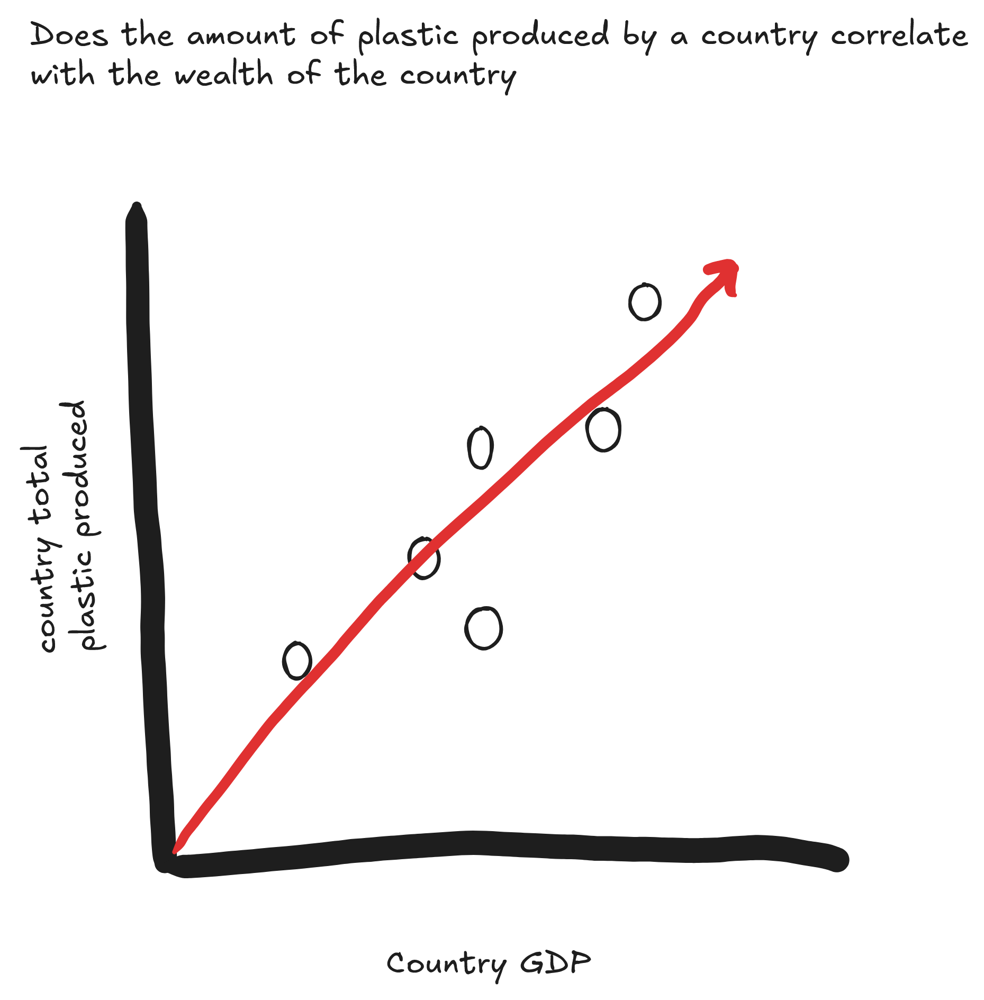

```{r}
#| label: packages-setup
library(tidyverse)
library(glue)
library(here)
library(jsonlite)
library(purrr)
```

### Check-In 1

```{r}
#| label: load_data
tuesdata <- tidytuesdayR::tt_load('2021-01-26')
plastics <- tuesdata$plastics
```

# Background

The data comes from Break Free from Plastic (BFFP). The data contains variables relating to types of plastic, where the plastic comes from, and country.

# Cleaning

the columns in the data have been assigned certain classes like (double, character). they also cleaned the names of the columns using the janitor package. They also took two data sets from 2020 and 2019 and bound the rows together.

# Research Questions

1.  Has the types of plastics that are being used changed significantly from 2019 to 2020
2.  How does the gap in total plastic consumption change between countries between 2019 and 2020 

# Supplemental Data Questions

1.  Does the amount of plastic produced by a country correlate with the wealth of the country
2.  Does the size of the company affect the amount of plastic produced

# visuals



.png)


### Check-In 2

```{r}
#| label: Summary 1 (non-modified, Function)

# How does the difference in total plastic consumption change between countries between 2019 and 2020

country_plas_diff <- function(country1, country2) {
  plastics |>
    filter(country %in% c(country1, country2)) |>
    group_by(year, country) |>
    summarize(tot_plastic = sum(grand_total), .groups = 'drop') |>
    arrange(desc(year)) |>
    group_by(year) |>
    summarize(plastic_diff = tot_plastic[country == country1] - tot_plastic[country == country2]) |>
    mutate(comparison = paste0(country1, ' - ', country2, ' (', year,')')) |>
    select(comparison, plastic_diff)
}

country_plas_diff('Ukraine', 'China')
```

from 2019 to 2020 the gap in total plastic produced between Ukraine and china has grown more than 100%

```{r}
#| label: Summary 2 (non-modified, Iteration)

# Has the types of plastics that are being used changed significantly from 2019 to 2020

plastic_types <- c("hdpe", "ldpe", "pet", "pp", "ps", "pvc", "o", "grand_total")

changes <- map_dbl(plastic_types,
                   function(type) {
                      plastics |>
                        group_by(year) |>
                        summarize(total = sum(across(all_of(type)), na.rm = TRUE),
                                  .groups = "drop") |>
                        arrange(year) |>
                        pull(total) |>
                      diff()
                      }
                   )

tibble(plastic_type = plastic_types,
       `2020-2019` = changes)
```

most types of plastics are being used less in 2020 when compared to 2019, the only exceptions being Polypropylene and Polyvinyl chloride

```{r}
#| label: Summary 3 (modified, Function)

# On average, how much plastic do countries produce per unit of GDP?

# load gdp data, from worldbank.org
# https://data.worldbank.org/indicator/NY.GDP.MKTP.CD?most_recent_year_desc=false
# data was pivoted to create a year variable
# cleaning GDP data to match plastics data
GDP_2019_2020 <- read.csv(here("GDP_data.csv"), skip = 4) |>
  select(Country.Name, X2019, X2020) |>
  rename(`2019` = X2019, `2020` = X2020) |>
  pivot_longer(
    cols = c(`2019`, `2020`),
    names_to = "year",
    values_to = "gdp") |>
  mutate(year = as.numeric(year)) |>
  rename(country = Country.Name) |>
  mutate(
    country = recode(
      country,
      "Cote d'Ivoire" = "Cote D_ivoire",
      "Ecuador" = "ECUADOR",
      "Hong Kong SAR, China" = "Hong Kong",
      "Korea, Rep." = "Korea",
      "Nigeria" = "NIGERIA",
      "Turkiye" = "Turkey",
      "United Kingdom" = "United Kingdom of Great Britain & Northern Ireland",
      "United States" = "United States of America",
      "Viet Nam" = "Vietnam"
    )
  )

# Summarizes total plastic use by country and year, excluding non-country entries.
plastic_summary <- plastics |>
  filter(country != "EMPTY") |>
  group_by(country, year) |>
  summarize(total_plastic = sum(grand_total, na.rm = TRUE), .groups = "drop")

# combine the data
combined_data <- plastic_summary |>
  inner_join(GDP_2019_2020, by = c("country", "year"))

# summary
plastic_wealth_summary <- function(year_input) {
  combined_data |>
    filter(year == year_input) |>
    mutate(plastic_per_gdp = total_plastic / gdp) |>
    summarize(year = year_input,
              avg_plastic_per_gdp = mean(plastic_per_gdp, na.rm = TRUE))
}

plastic_wealth_summary(2020)
```

in 2020, the average amount of plastic produced per GDP for a country was 6.189 * 10^-8

```{r}
#| label: summary 3 (modified, Iteration)

# On average, how much plastic do countries produce per unit of GDP, by country wealth size and year
# my original other question was too difficult to fidn data for, so I answered this question

years <- c(2019, 2020)

results <- tibble()

group_gdp_plastics_data <- combined_data |> 
  mutate(wealth_group = factor(ntile(gdp, 3), labels = c("Low", "Medium", "High")),
         plastic_per_gdp = total_plastic / gdp)

for (y in years) {
  temp <- group_gdp_plastics_data |>
    filter(year == y) |>
    mutate(
      plastic_per_gdp = total_plastic / gdp
    ) |>
    group_by(wealth_group) |>
    summarize(
      avg_plastic_per_gdp = mean(plastic_per_gdp, na.rm = TRUE),
      .groups = "drop"
    ) |>
    mutate(year = y)
  
  results <- bind_rows(results, temp)
}

results
```

the lowest average plastic per GDP belonged to the wealthiest countries in 2020, while the highest average plastic per GDP belonged to the least wealthy countries in 2020.


### Check-In 3

```{r}
# note: GDP data comes from Check In 2

# matching countries to csv in order to match codes

plastics <- plastics |>
  filter(country != "EMPTY") |>
  mutate(country = recode(
    country,
    "Taiwan_ Republic of China (ROC)" = "Taiwan, Province of China",
    "Cote D_ivoire" = "Côte d'Ivoire",
    "ECUADOR" = "Ecuador",
    "NIGERIA" = "Nigeria",
    "Netherlands" = "Netherlands, Kingdom of the",
    "Tanzania" = "Tanzania, United Republic of",
    "Turkey" = "Türkiye",
    "United Kingdom" = "United Kingdom of Great Britain and Northern Ireland",
    "Vietnam" = "Viet Nam",
   "Korea" = "Korea, Republic of",
    "United Kingdom of Great Britain & Northern Ireland" = "United Kingdom of Great Britain and Northern Ireland"
  ))

# reading in csv, found here https://github.com/lukes/ISO-3166-Countries-with-Regional-Codes/blob/master/all/all.csv

Country_Codes <- read.csv(here('Country-Codes.csv'),
                          colClasses = c("character", "character")) |>
  rename(country = name) |>
  select(country, country.code)

# join

plastics_w_code <- plastics |>
  left_join(Country_Codes, by = "country")

# take unique country codes

codes <- plastics_w_code |>
  distinct(country.code) |>
  pull(country.code)

# api call function

collect_api_data <- function(code) {
  base_url <- 'https://restcountries.com/v3.1/alpha/'
  
  ctry_url <- glue('{base_url}','{code}')
  
  ctry_data <- fromJSON(ctry_url)
  
  if(length(ctry_data) == 0){
    return(NA)
  }
  
  else{
    ctry_data |>
      pull(languages)
  }
} 

# iterate through unique codes

Languages <- map(codes, collect_api_data)

# given a list of data frames formatted weirdly, so pivoting

Language_pivot <- function(list_df){
  list_df |>
    pivot_longer(cols = everything(),
               names_to = 'Code',
               values_to = 'Language') |>
    select(Language)
}

# iterate through the list of data frames

Languages <- map(Languages, Language_pivot)

# combine the languages into one value

Combine_lang <- function(list_df){
  list_df |>
    summarize(all_languages = paste(Language, collapse = ', '))
}

# iterate through list of data frames

Languages <- map(Languages, Combine_lang)

# pull languages

collect_lang <- function(list_df){
  list_df |>
    pull(all_languages)
}

# create languages data frame with codes and languages

languages_df <- tibble(
  country.code = codes,
  all_languages = map(Languages, collect_lang))

# checking how many columns I need for separating languages

languages_df |>
  mutate(n_lang = str_count(all_languages, ",") + 1) |>
  pull(n_lang) |>
  max()

# join all data (including GDP data from Check-in 2), and separating languages (this is our "meta" dataset)

Updated_Plastics <- plastics_w_code |>
  inner_join(languages_df, by = 'country.code') |>
  inner_join(combined_data, by = c('country', 'year')) |>
  separate_wider_delim(cols = all_languages,
                       delim = ", ",
                       names = paste0("lang", 1:11),
                       too_few = "align_start")
```

```{r}
# Plastic count per countries by language spoken
Updated_Plastics |>
  pivot_longer(
    cols = starts_with("lang"),
    names_to = "lang_num",
    values_to = "language"
  ) |>
  filter(!is.na(language)) |>
  add_count(language, name = "lang_count") |>
  filter(lang_count >= 50) |>
  ggplot(aes(x = language, y = total_plastic)) +
  geom_boxplot() +
  theme(axis.text.x = element_text(angle = 45, hjust = 1)) +
  labs(
  title = "Distribution of Total Plastic Waste by Language",
  subtitle = "Languages appearing at least 50 times in the dataset (2019–2020)",
  x = "Language",
  y = "Total Plastic Waste",
)
```
According to the graph, countries that include English or Filipino among their reported languages tend to show higher maximum levels of plastic waste from 2019-2020. Other common languages include French and Italian, while Romansh and Swiss German display much greater variability in plastic waste, as indicated by the wide spread of their boxplots.

```{r}
# Aggregate to country-year level
plastics_country <- Updated_Plastics |>
  group_by(country, year, gdp) |>
  summarize(
    hdpe = sum(hdpe, na.rm = TRUE),
    ldpe = sum(ldpe, na.rm = TRUE),
    o = sum(o, na.rm = TRUE),
    pet = sum(pet, na.rm = TRUE),
    pp = sum(pp, na.rm = TRUE),
    ps = sum(ps, na.rm = TRUE),
    pvc = sum(pvc, na.rm = TRUE),
    .groups = "drop"
  )

# Create GDP ranges
plastics_country <- Updated_Plastics |>
  mutate(
    gdp_range = case_when(
      gdp < 5e10 ~ "Low",
      gdp < 2e11 ~ "Lower-Middle",
      gdp < 5e11 ~ "Middle",
      gdp < 1e12 ~ "Upper-Middle",
      gdp >= 1e12 ~ "High"
    )
  )

# Create segmented + sorted bar graph
plastics_country |>
  mutate(
  gdp_range = factor(
    gdp_range,
    levels = c("Low", "Lower-Middle", "Middle", "Upper-Middle", "High")
  )
) |>
  pivot_longer(
    cols = c(hdpe, ldpe, o, pet, pp, ps, pvc),
    names_to = "plastic_type",
    values_to = "plastic_amount"
  ) |>
  group_by(gdp_range, plastic_type) |>
  summarize(avg_plastic = mean(plastic_amount, na.rm = TRUE), .groups = "drop") |>
  ggplot(aes(x = gdp_range, y = avg_plastic, fill = plastic_type)) +
  geom_col(position = "fill") +
  labs(
    title = "Proportion of Average Plastic Types by GDP Range",
    x = "GDP Range",
    y = "Proportion",
    fill = "Plastic Type"
  )
```
This graph shows that the composition of plastic types is relatively similar across GDP ranges. Other plastics (labeled 'o') make up the largest proportion in all groups except in the "Low" and "Lower-Middle" GDP range, who tend to have a higher share of PET usage. The "Middle" and "Higher" GDP ranges have a more balanced distribution across the different plastic types.